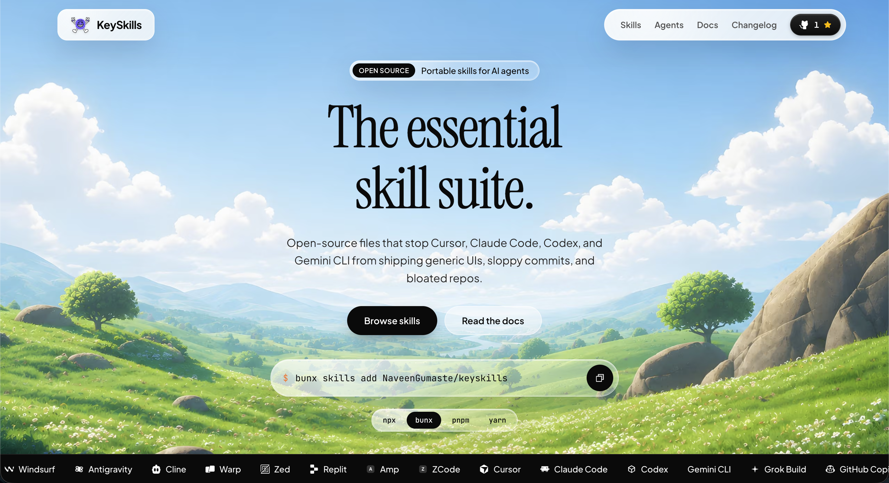

<p align="center">
  <a href="https://keyskills.ngxlabs.tech/">
    
  </a>
</p>

# Keyskills

Portable [Agent Skills](https://agentskills.io/) for coding agents: SEO, design, git, cleanup, and DevOps.

🌐 **Website:** [keyskills.ngxlabs.tech](https://keyskills.ngxlabs.tech/)

[](https://keyskills.ngxlabs.tech/)
[](LICENSE)
[](https://skills.sh/NaveenGumaste/keyskills)

## Install

```bash
npx skills add NaveenGumaste/keyskills
```

Same command works with `bunx`, `pnpm dlx`, and `yarn dlx`.

The CLI lists five skills and asks which ones to install, which agents to target, and project vs global. Picking a skill installs that suite.

### Non-interactive

```bash
npx skills add NaveenGumaste/keyskills --list
npx skills add NaveenGumaste/keyskills --skill seo-setup -y
npx skills add NaveenGumaste/keyskills --skill seo-setup --skill design-skill -a claude-code -a cursor -y
npx skills add NaveenGumaste/keyskills --all -y
```

## Skills

| Install name | When to pick it |
| --- | --- |
| [`seo-setup`](skills/seo-setup/SKILL.md) | Metadata, sitemap, robots, JSON-LD, OG, AEO/AI-search, `llms.txt`. Additive; lists changes first. |
| [`design-skill`](skills/design-skill/SKILL.md) | Frontend UI that should not look like default AI slop. Landing pages, portfolios, redesigns. |
| [`git-skill`](skills/git-skill/SKILL.md) | Commits, branches, ignores, PR hygiene. Lint+build then atomic commits+push; PR from/to, assignee, labels. |
| [`codebase-cleanup`](skills/codebase-cleanup/SKILL.md) | Dead code, unused deps, lint. Asks delete / archive / keep; default keep. |
| [`devops-skill`](skills/devops-skill/SKILL.md) | CI/CD, Docker, env, deploy, Terraform, monitoring. Inspects the repo first; adds only what that architecture needs. |

After install, ask the agent in plain language (`add SEO`, `commit and push`, `clean this repo`, `add DevOps`). Name the skill if it does not pick it up.

`design-skill` is derived from [taste-skill](https://github.com/Leonxlnx/taste-skill).

## Contributing

Fork, branch off `main` (`feat/`, `fix/`, `docs/`), and open a PR against `main`. Keep one concern per PR. Match conventional commits (`feat:`, `fix:`, `docs:`).

A skill lives at `skills/<name>/SKILL.md`. `name` in the YAML frontmatter must match the folder. `description` must say what it does and when to use it. Follow the [Agent Skills spec](https://agentskills.io/specification) and the shape of the existing files (inspect first, conservative defaults).

## Checking

This repo is skill documents, not an app. There is no test suite. Before a PR:

```bash
npx skills add . --list
```

That must show all five skills. Then install the changed skill from the working tree and run it once on a throwaway project:

```bash
npx skills add . --skill <name> -a <your-agent> -y
```

Confirm the skill still lists work before mutating anything, and that unanswered items stay put (cleanup default is keep; SEO does not overwrite working tags; git does not force-push or rewrite history; DevOps does not apply or deploy production without OK).

In the PR, say what changed, the commands you ran, and the smoke result (or that it is docs-only). Reviewers re-run discovery on the branch and re-read the skill diff. Nothing merges if discovery breaks or the skill silently drops its safety rules.

## License

[MIT](LICENSE)
